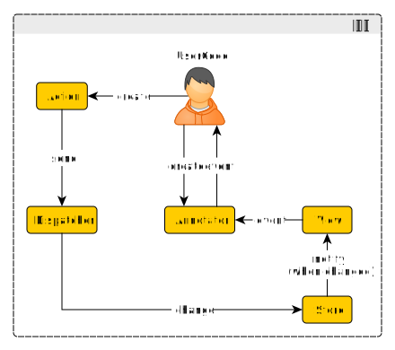
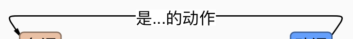
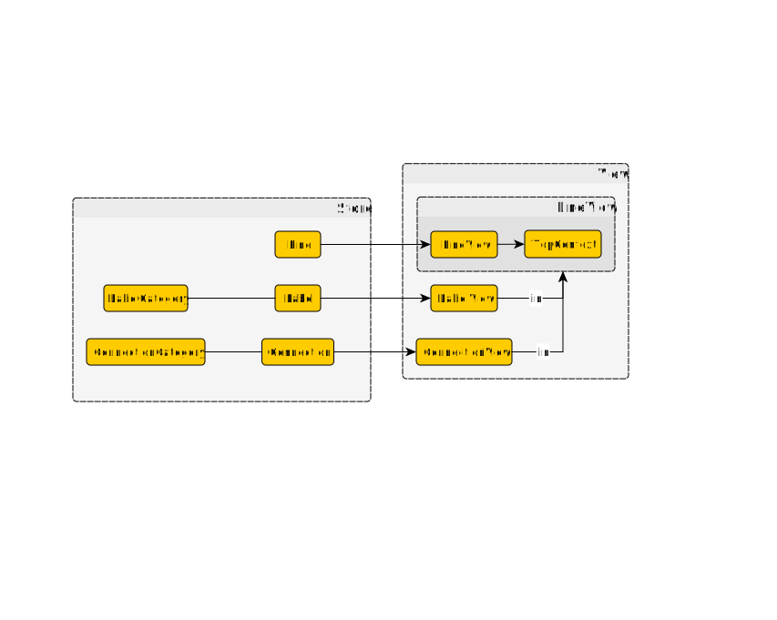
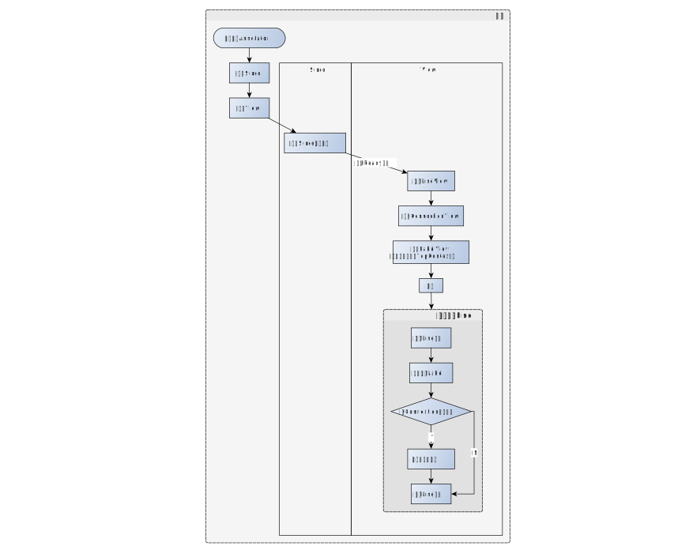
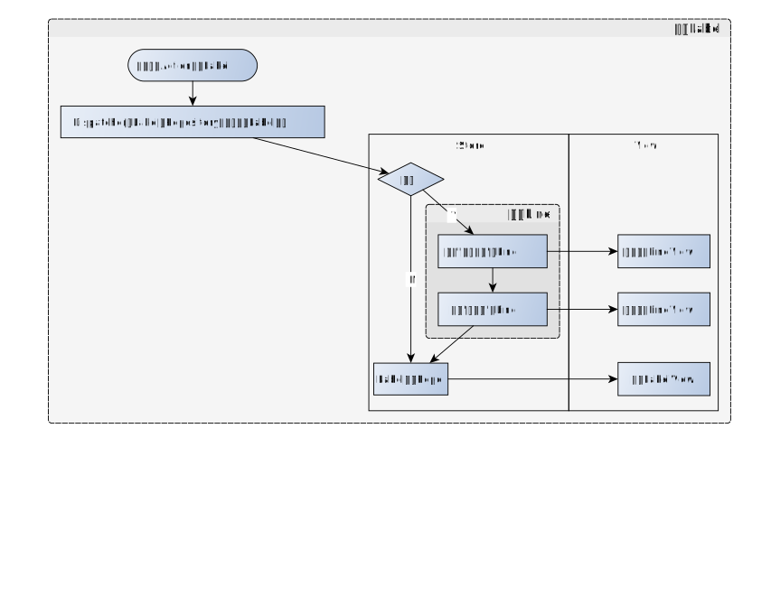
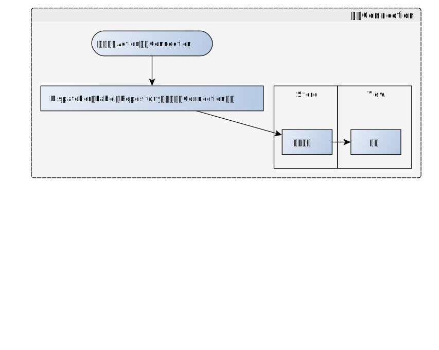
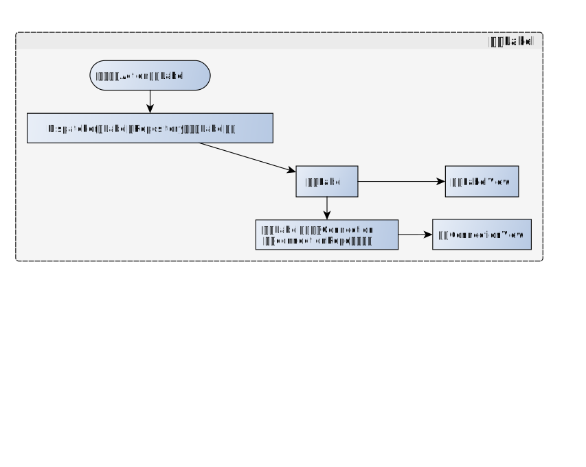
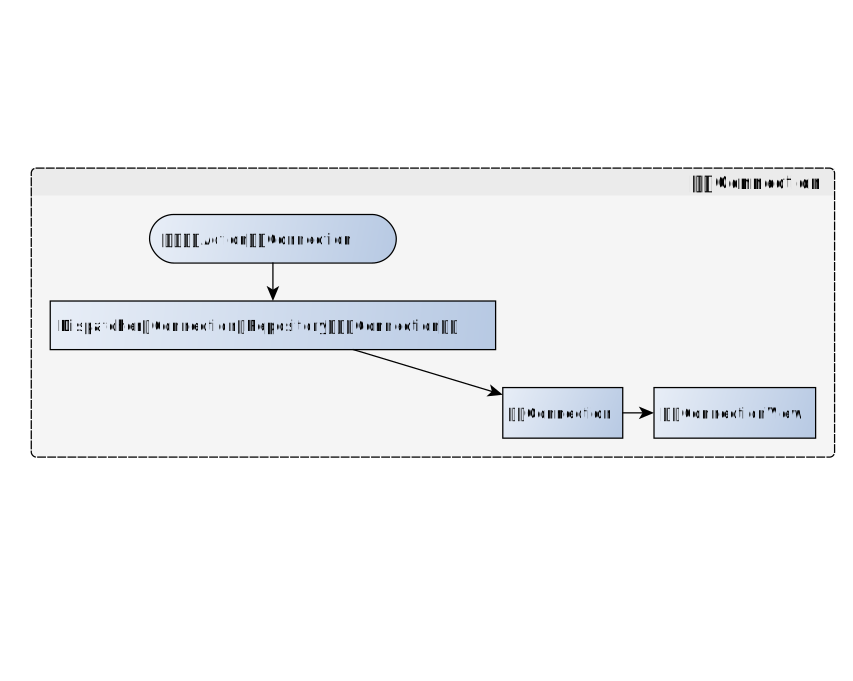

# Developer Guides

首先感谢您对本项目的支持，我们非常欢迎您加入开发。

⚠️：本文中的图示并非真正的UML或流程图，而只是示意图。

## 在参与开发之前需要具备的知识

1. 我们会使用[Typescript](http://www.typescriptlang.org)语言

2. 我们使用的库有

   - [SVG.js](http://svgjs.com)

   - [RxJS](https://rxjs-dev.firebaseapp.com)
   - [events](https://www.npmjs.com/package/events)

3. 我们使用[webpack](https://webpack.github.io)来进行打包，并使用[npm](https://www.npmjs.com)与[yarn](https://yarnpkg.com/)来进行依赖管理和包的发布。

4. 其他相关知识

   - SVG基本知识

## 架构

 本项目参考了[Flux](http://www.ruanyifeng.com/blog/2016/01/flux.html)架构，并参考了一些DDD中的想法。

其中的`Store`、`View`、`Action`、`Dispatcher`都和[Flux](http://www.ruanyifeng.com/blog/2016/01/flux.html)架构中的概念相似。

而`Annotator`则是为了给用户提供一个统一的控制接口。

## 概念

在我们的 Ubiquitous language 中，我们这样称呼各个对象：

- `Line` [View Code](https://github.com/synyi/poplar/blob/master/src/Annotator/Store/Entities/Line.ts)

  像这样的一行字：

  

  被称为`Line`，`Line`在全篇文本（含换行、空格等）的开始索引被称为其`startIndex`，对应的结束（超尾）索引被称为其`endIndex`。

- `LabelCategory` [View Code](https://github.com/synyi/poplar/blob/master/src/Annotator/Store/Entities/LabelCategory.ts)

  `LabelCategory`代表每个`Label`所属的分类，它储存了这个分类所有`Label`共有的信息：

  - `text`: 这类`Label`的文字
  - `color`: 这类`Label`绘制时的背景颜色
  - `borderColor`: 这类`Label`绘制时的边框颜色

- `Label` [View Code](https://github.com/synyi/poplar/blob/master/src/Annotator/Store/Entities/Label.ts)

  像这样的一个标注：

  

  被称为`Label`。

  在全篇文本（含换行、空格等）的开始索引被称为其`startIndex`，对应的结束（超尾）索引被称为其`endIndex`。

- `ConnectionCategory` [View Code](https://github.com/synyi/poplar/blob/master/src/Annotator/Store/Entities/ConnectionCategory.ts)

  与`LabelCategory`相似，保存了这个分类下的`Connection`的信息。

  - `text`: 这类`Connection`的文字

- `Connection` [View Code](https://github.com/synyi/poplar/blob/master/src/Annotator/Store/Entities/Connection.ts)

  像这样一条连接的线

  

  被称为`Connection`。

  箭头开始的`Label`称为`Connection`的`from`，箭头结束的`Label`称为`Connection`的`to`。

  `from`和`to`中在先（即`startIndex`小）的称为`prior`，在后的称为`posterior`。

这些对象都被建模为`Store`中的`Entity`（即根据系统内部生成的`id`来区分的对象），并拥有各自的`Repository`（挂在`Store`类下）。

此外，`Line`、`Label`和`Connection`都有其对应的`View`（命名法为直接在后面加`View`），也被建模为`Entity`（注意所有`…View`的`id`都和对应`Store`中的`Entity`的`id`相同），也拥有各自的`Repository`（挂在`View`类下）。

Code：

- [LineView](https://github.com/synyi/poplar/blob/master/src/Annotator/View/Entities/LineView.ts)
- [LabelView](https://github.com/synyi/poplar/blob/master/src/Annotator/View/Entities/LabelView.ts)
- [ConnectionView](https://github.com/synyi/poplar/blob/master/src/Annotator/View/Entities/ConnectionView.ts)

此外还在`View`中引入了`Line`的`TopContext`概念，这个类指某个`Line`上面要绘制的各种东西（`Label`和`Connection`）的绘制环境。

Code: 

- [TopContext](https://github.com/synyi/poplar/blob/master/src/Annotator/View/Entities/TopContext.ts)

引入这个概念的目的是让因为上方的`TopContext`中添加东西之后，由于空间不够而要让下面的所有东西向下移动时，可以批量移动某一行上面的所有东西。

### 图示

## 业务流程

1. 首屏

   

   其中`Connection` “准备好”指其连接的两个`LabelView`均已经被绘制。

   “重新布局”会重新定位受直接影响的行以下的所有行（由svg.js自行完成）和这些行所附带的`TopContext`（手动用代码控制）

2. 添加`Label`

   

   其中`LabelView`绘制前会添加到`TopContext`，之后可能发生的重新布局逻辑和首屏相似，此处不再标出。

3. 添加`Connection`

   

   同样绘制前会添加到`TopContext`，并可能会触发重新布局。

4. 移除`Label`

   

5. 移除`Connection`

   

6. Update

   所有的Update都是先删除一次，再添加一次。

## 还需要改善的方向

- 单元测试

  View部分的单元测试比较难写（关键是有关DOM的测试比较麻烦）。

  Store部分的覆盖率也不够高。

- 效率（尤其是首屏的效率）

  目前效率上的情况大概是，30000字文本与1000+的Label能在3s内完成首屏渲染。

  可以考虑进一步的优化。
